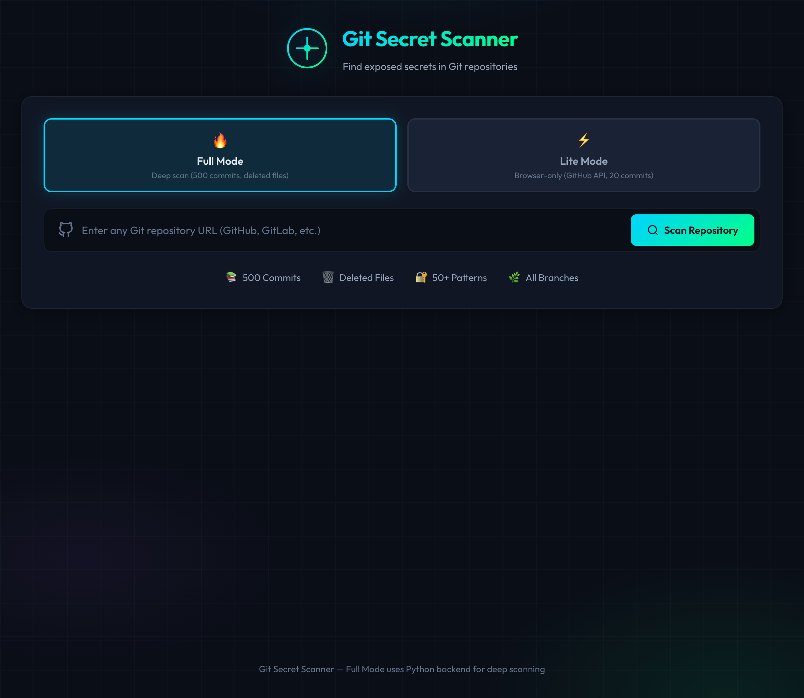
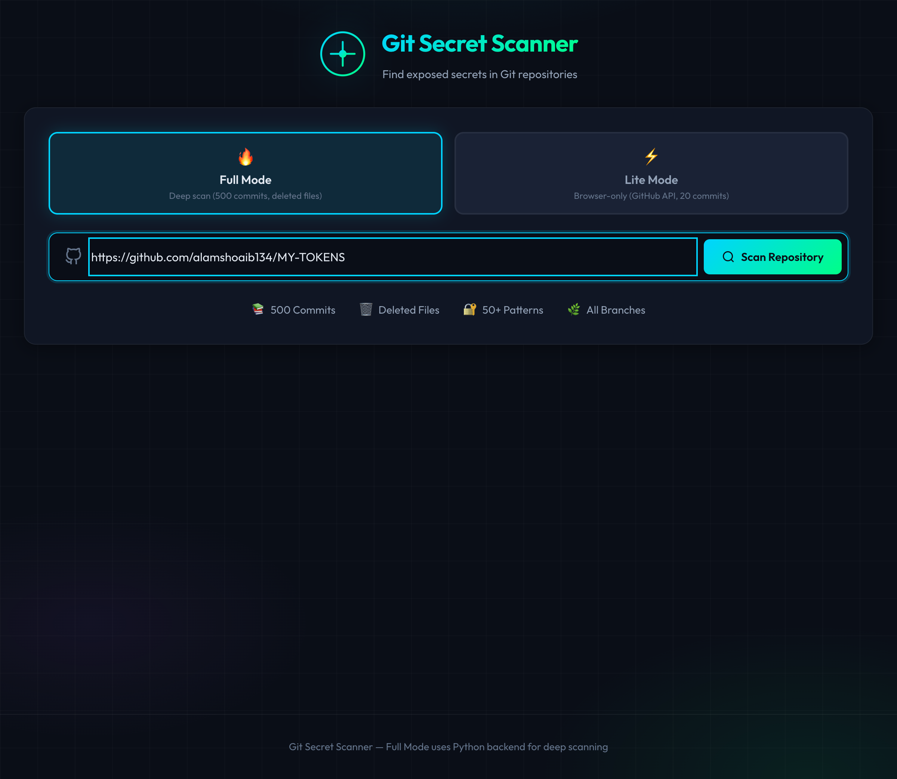
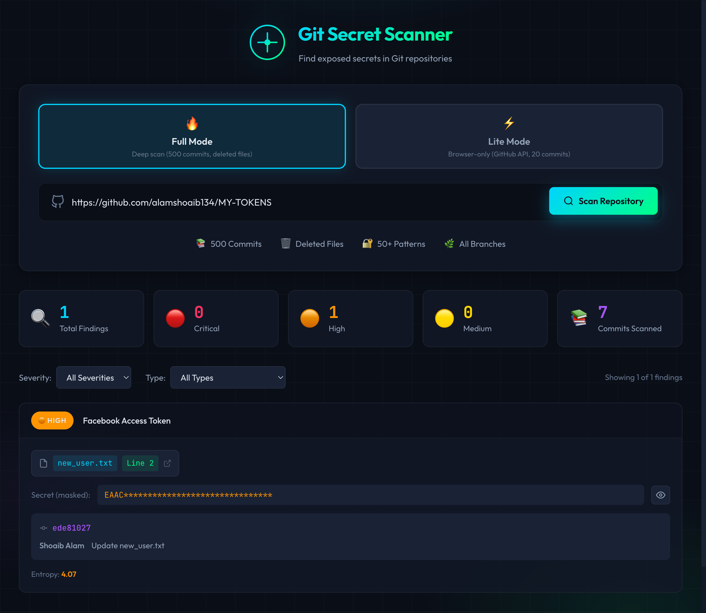
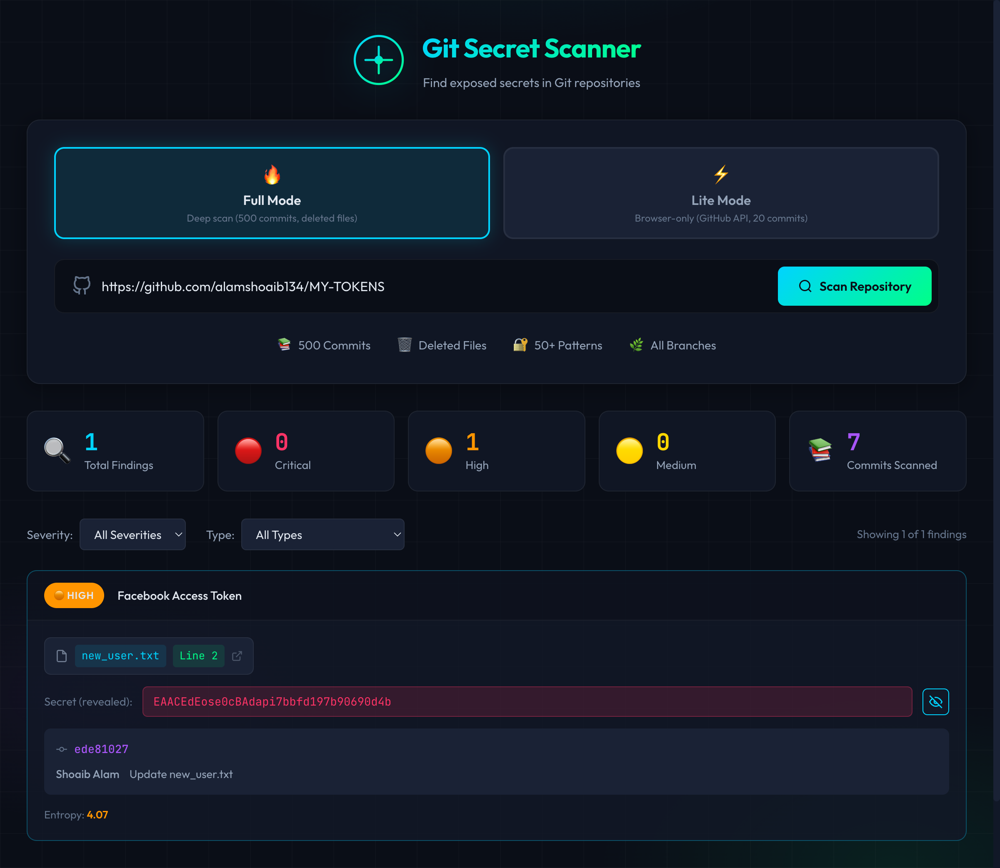
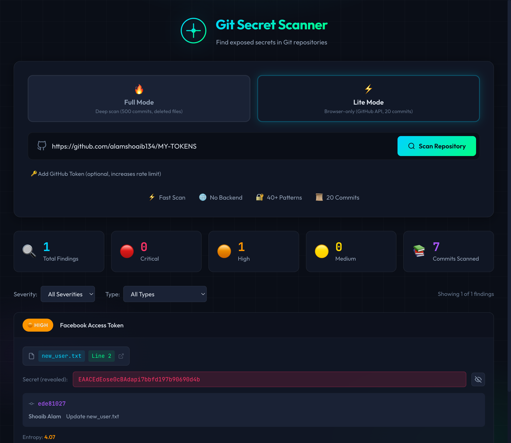
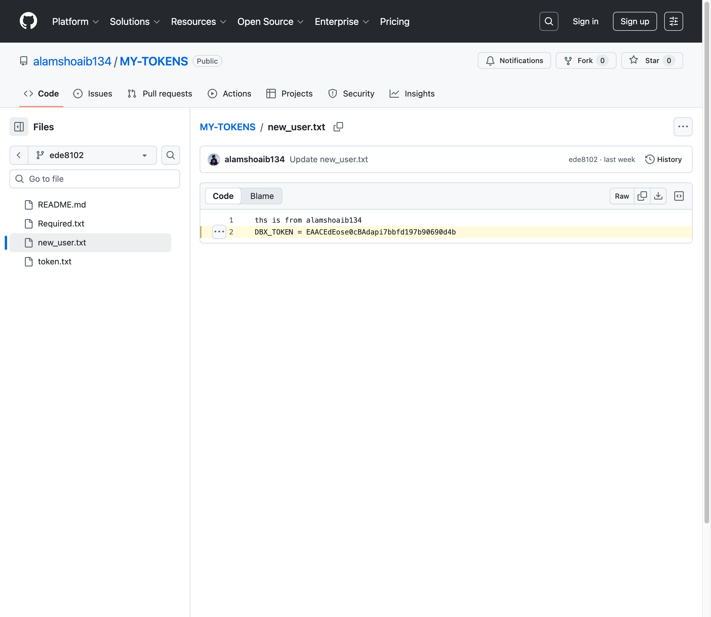

# 🔍 Git Secret Scanner

A powerful tool to scan Git repositories for exposed secrets, tokens, passwords, and confidential values. Offers **two scanning modes** for flexibility!


## 📸 Screenshots

### Home Screen


### Enter Repository URL


### Scan Results with Masked Secrets


### Reveal Full Secret


### Lite Mode (Browser-Only)


### Click to Open in GitHub (Line Highlighted)


---

## 🔥 Two Scanning Modes

| Mode | Description | Use Case |
|------|-------------|----------|
| **🔥 Full Mode** | Python backend, clones repo, scans 500 commits | Deep scanning, deleted files, complete history |
| **⚡ Lite Mode** | Browser-only, GitHub API | Quick scans, no backend needed |

## ✨ Features

### Full Mode (Python Backend)
- 📚 Scans up to **500 commits**
- 🗑️ Finds secrets in **deleted files**
- 🌿 Scans **all branches**
- 🔐 **50+ secret patterns**
- 🔗 Supports GitHub, GitLab, Bitbucket, any Git URL

### Lite Mode (Browser-Only)
- ⚡ **Fast** - no backend needed
- 🌐 Runs entirely in browser
- 📜 Scans **20 commits** via GitHub API
- 🔐 **40+ secret patterns**
- 🔒 Privacy-first - no data leaves your browser

### UI Features
- 👁️ **Reveal/Mask Toggle** - View full secrets when needed
- 🔗 **Clickable GitHub Links** - Click to open exact file & line on GitHub
- 🎨 **Cyberpunk Theme** - Beautiful dark UI with neon accents
- 📊 **Severity Classification** - Critical, High, Medium, Low
- 🔍 **Filter by Severity/Type** - Find what matters

## 🚀 Quick Start

### Option 1: Full Mode (Recommended)

**Terminal 1 - Backend:**
```bash
cd backend
python3 -m venv venv
source venv/bin/activate  # Windows: venv\Scripts\activate
pip install -r requirements.txt
python app.py
```

**Terminal 2 - Frontend:**
```bash
npm install
npm run dev
```

Open `http://localhost:3000` and select **🔥 Full Mode**!

### Option 2: Lite Mode Only

```bash
npm install
npm run dev
```

Open `http://localhost:3000` and select **⚡ Lite Mode** - no backend needed!

## 🧪 Test It Out

Try scanning this test repository with intentional secrets:
```
https://github.com/alamshoaib134/MY-TOKENS
```

## 🚢 Deployment

### Frontend → Vercel

```bash
npm run build
# Deploy dist/ folder to Vercel
```

Set environment variable: `VITE_BACKEND_URL=https://your-backend.railway.app`

### Backend → Railway

1. Create new Railway project
2. Connect GitHub repo, select `backend/` folder
3. Deploy!

## 🎯 What It Detects

| Category | Examples |
|----------|----------|
| **Cloud Provider Keys** | AWS Access Keys, Azure Storage Keys, GCP API Keys |
| **API Tokens** | GitHub, Slack, Stripe, SendGrid, Twilio, Discord |
| **Private Keys** | RSA, OpenSSH, DSA, EC, PGP private keys |
| **Database Credentials** | MongoDB, PostgreSQL, MySQL, Redis URIs |
| **Generic Secrets** | Passwords, API keys, tokens, auth headers, JWTs |

## 📁 Project Structure

```
git-secret-scanner/
├── src/                    # React frontend
│   ├── App.tsx             # Main component with mode selector
│   ├── scanner.ts          # Lite mode (browser) scanner
│   └── ...
├── backend/                # Python backend (Full Mode)
│   ├── app.py              # FastAPI server
│   ├── requirements.txt
│   └── Procfile            # Railway deployment
├── screenshots/            # Demo screenshots
├── package.json
├── vercel.json
└── README.md
```

## 🛡️ Security Notes

- **Full Mode**: Clones repos to temp directory, deleted after scan
- **Lite Mode**: All data stays in browser, no external servers
- Secrets are masked by default with reveal toggle
- Only scan repos you own or have permission to audit

## 📝 License

MIT License - Feel free to use, modify, and distribute.

## ⚠️ Disclaimer

This tool is for educational and authorized security testing purposes only. Always obtain proper authorization before scanning repositories.
