# 🏗️ High-Level Design (HLD)

## Git Secret Scanner - System Architecture

---

## 1. System Overview

```mermaid
flowchart TB
    subgraph UI["🖥️ User Interface (React + TypeScript)"]
        URL[URL Input]
        MODE[Mode Toggle<br/>Full / Lite]
        RESULTS[Results Dashboard]
    end

    subgraph FULL["🔥 FULL MODE (Python Backend)"]
        CLONE[Clone Repository]
        BRANCHES[Scan All Branches]
        COMMITS[500 Commit History]
        DELETED[Deleted File Detection]
        PATTERNS1[50+ Secret Patterns]
        API[FastAPI Server<br/>Port 8000]
    end

    subgraph LITE["⚡ LITE MODE (Browser Only)"]
        GHAPI[GitHub REST API]
        TREES[Fetch File Trees]
        DIFFS[20 Commit Diffs]
        PATTERNS2[40+ Secret Patterns]
        SCANNER[scanner.ts<br/>Client-side JS]
    end

    UI --> FULL
    UI --> LITE
    FULL --> API
    LITE --> SCANNER
```

---

## 2. Architecture Components

### 2.1 Frontend Layer

### 2.2 Backend Layer

---

## 3. Data Flow Diagrams

### 3.1 Full Mode Flow

### 3.2 Lite Mode Flow

---

## 4. Deployment Architecture

---

## 5. Security Architecture

---

## 6. Technology Stack

---

## 7. Component Interaction

---

## 8. Scalability Considerations

---

## 9. Mode Comparison

