# 🔧 Low-Level Design (LLD)

## Git Secret Scanner - Detailed Technical Design

---

## 1. Module Architecture

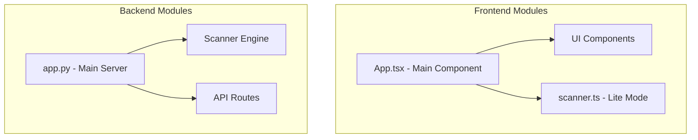

---

## 2. Frontend State Management

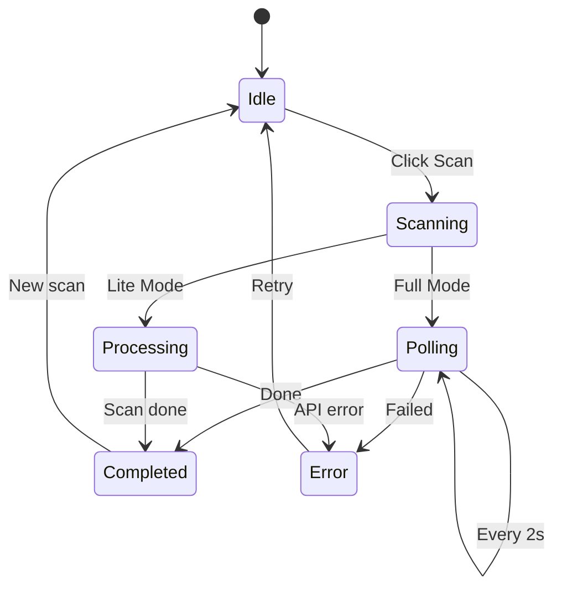

### State Interface

```typescript
interface AppState {
  gitUrl: string;
  githubToken: string;
  mode: 'full' | 'lite';
  scanning: boolean;
  progress: number;
  progressMessage: string;
  results: ScanResults | null;
  error: string | null;
  filterSeverity: string;
  filterType: string;
  revealedSecrets: Set<string>;
}
```

---

## 3. Component Hierarchy

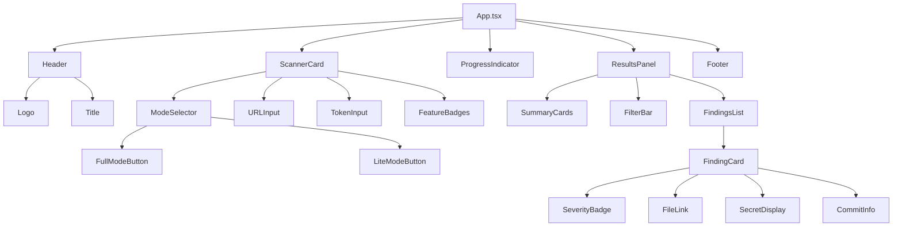

---

## 4. Secret Pattern Categories

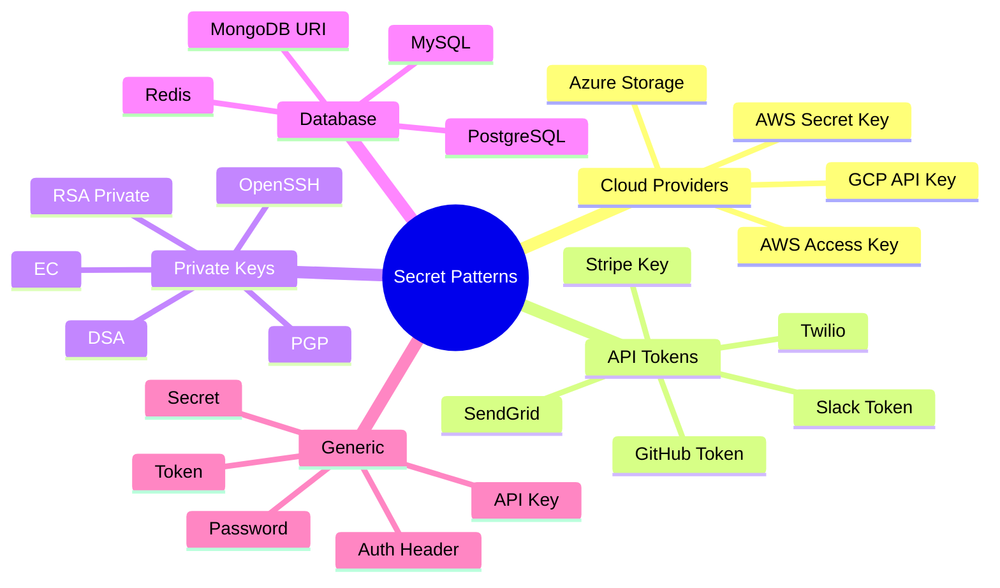

### Pattern Structure

```typescript
interface SecretPattern {
  name: string;      // "AWS Access Key ID"
  pattern: RegExp;   // /AKIA[0-9A-Z]{16}/g
  severity: 'critical' | 'high' | 'medium' | 'low';
}
```

---

## 5. Lite Mode Scan Flow

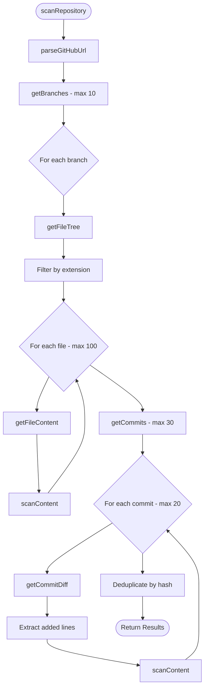

---

## 6. Backend Scan Flow

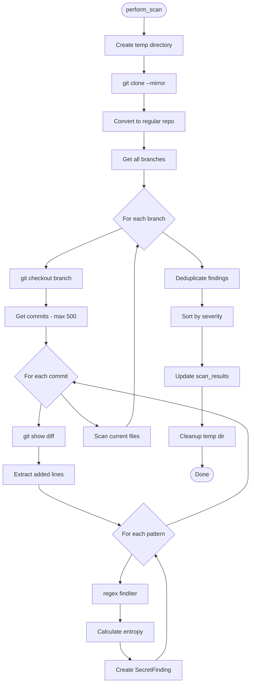

---

## 7. API Endpoints

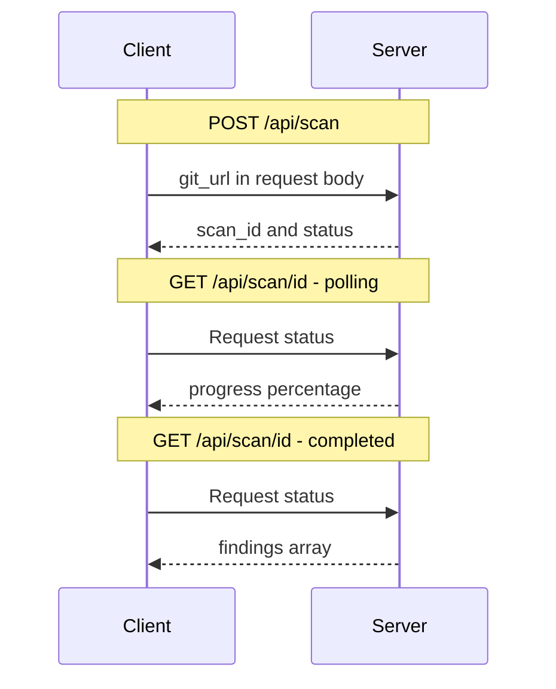

### Response Schema

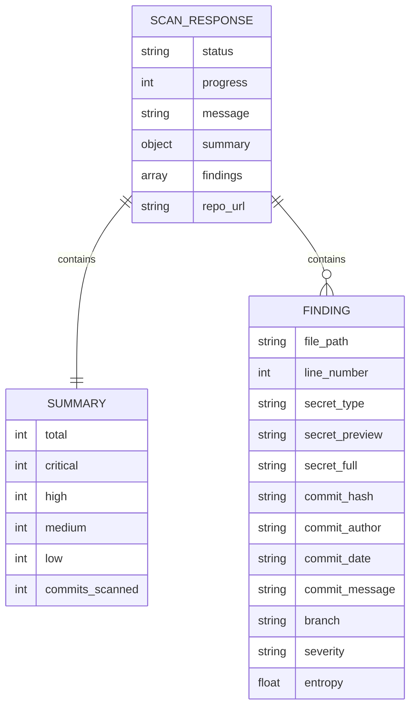

---

## 8. Entropy Calculation

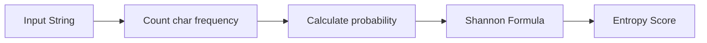

### Formula

```
H(X) = -Σ P(xᵢ) × log₂(P(xᵢ))

Where:
- H(X) = entropy of string X
- P(xᵢ) = probability of character xᵢ
- Higher entropy (>4.0) = more random = likely secret

Examples:
- "password123"  → entropy ≈ 3.18 (LOW)
- "aK9$mP2@xL4!" → entropy ≈ 4.58 (HIGH)
- "AKIAIOSFODNN" → entropy ≈ 3.25 (MEDIUM)
```

---

## 9. File Extension Filter

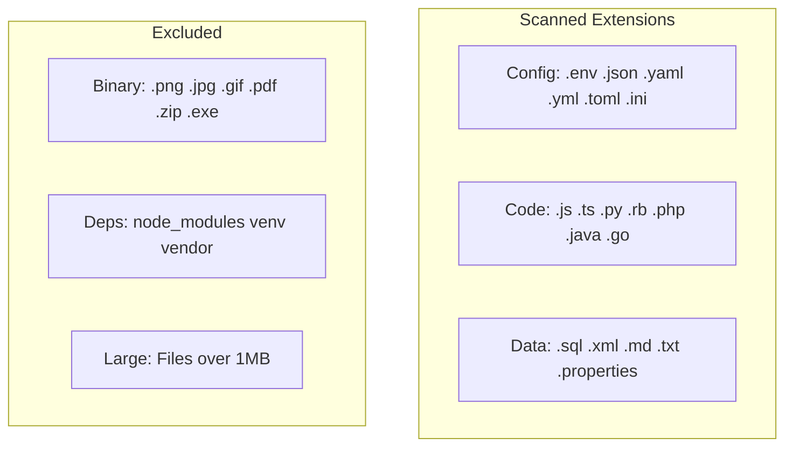

---

## 10. Error Handling

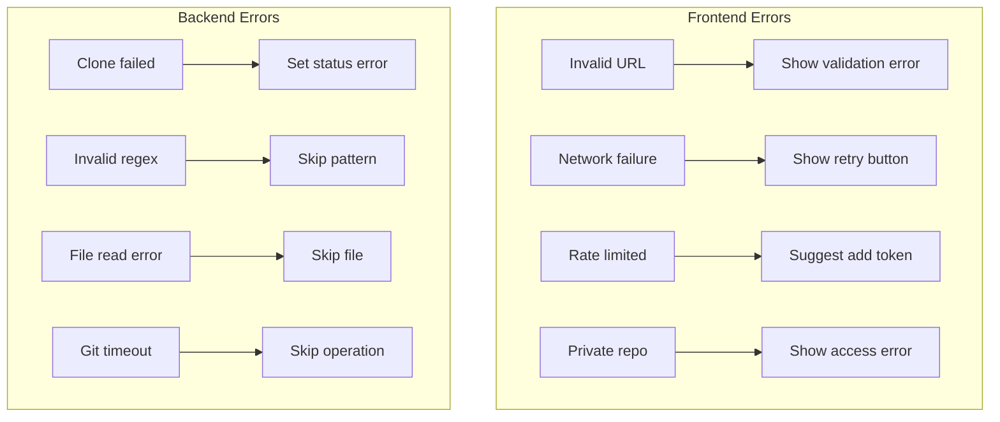

---

## 11. Finding Deduplication

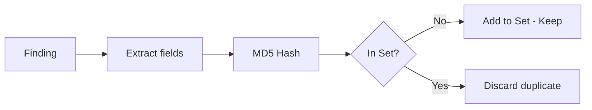

---

## 12. Severity Classification

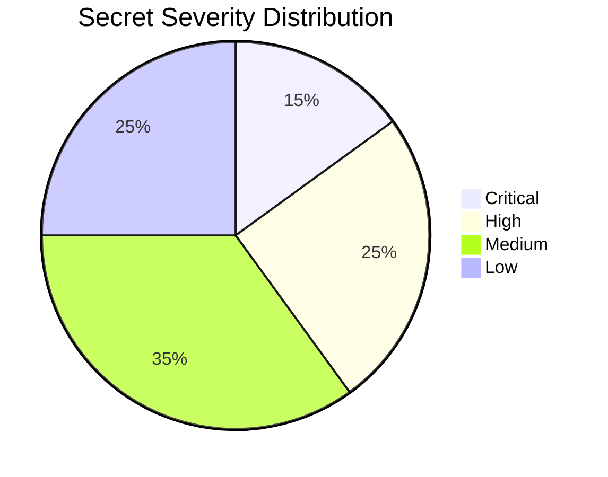

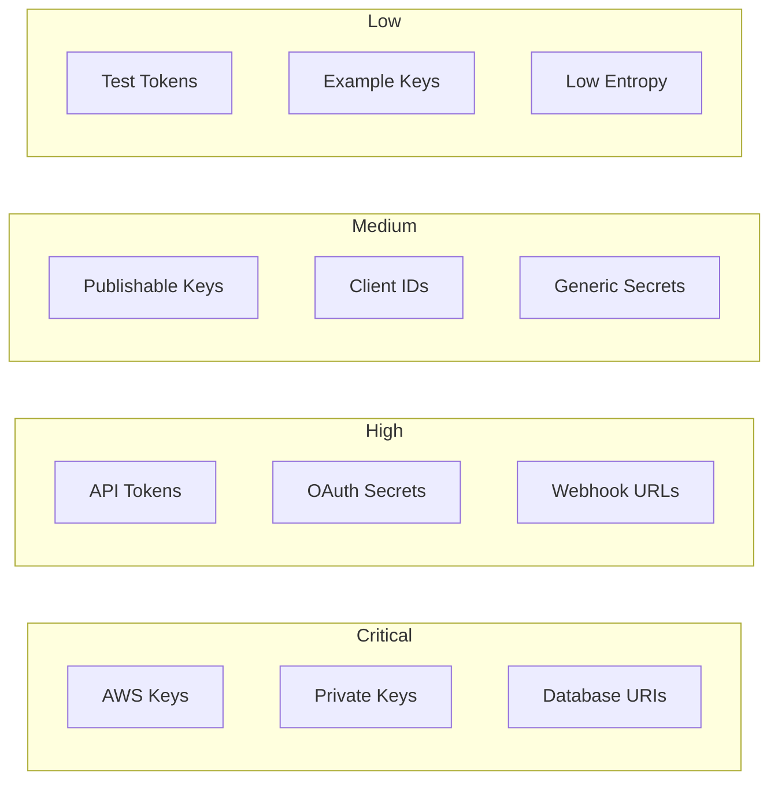

---

## 13. Performance Optimizations

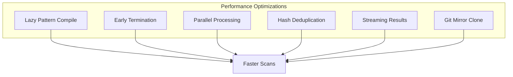

---

## 14. Testing Strategy

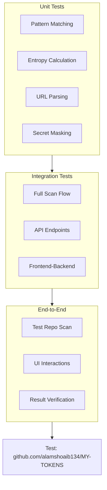

---

## 15. Class Diagram

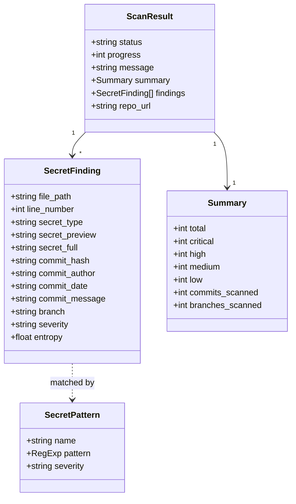

---

## 16. Request Response Flow

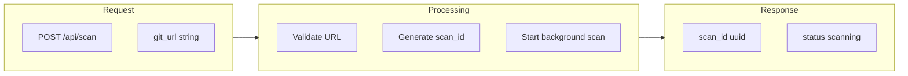
