# 🔧 Low-Level Design (LLD)

## Git Secret Scanner - Detailed Technical Design

---

## 1. Module Architecture


---

## 2. Frontend State Management


### State Interface

```typescript
interface AppState {
  gitUrl: string;
  githubToken: string;
  mode: 'full' | 'lite';
  scanning: boolean;
  progress: number;
  progressMessage: string;
  results: ScanResults | null;
  error: string | null;
  filterSeverity: string;
  filterType: string;
  revealedSecrets: Set<string>;
}
```

---

## 3. Component Hierarchy


---

## 4. Secret Pattern Categories


### Pattern Structure

```typescript
interface SecretPattern {
  name: string;      // "AWS Access Key ID"
  pattern: RegExp;   // /AKIA[0-9A-Z]{16}/g
  severity: 'critical' | 'high' | 'medium' | 'low';
}
```

---

## 5. Lite Mode Scan Flow


---

## 6. Backend Scan Flow


---

## 7. API Endpoints


### Response Schema


---

## 8. Entropy Calculation


### Formula

```
H(X) = -Σ P(xᵢ) × log₂(P(xᵢ))

Where:
- H(X) = entropy of string X
- P(xᵢ) = probability of character xᵢ
- Higher entropy (>4.0) = more random = likely secret
```

---

## 9. File Extension Filter


---

## 10. Error Handling


---

## 11. Finding Deduplication


---

## 12. Severity Classification

```mermaid
graph LR
    subgraph Critical["🔴 Critical"]
        C1[AWS Keys]
        C2[Private Keys]
        C3[Database URIs]
    end

    subgraph High["🟠 High"]
        H1[API Tokens]
        H2[OAuth Secrets]
        H3[Webhook URLs]
    end

    subgraph Medium["🟡 Medium"]
        M1[Publishable Keys]
        M2[Client IDs]
        M3[Generic Secrets]
    end

    subgraph Low["🟢 Low"]
        L1[Test Tokens]
        L2[Example Keys]
        L3[Low Entropy]
    end
```




---

## 13. Performance Optimizations

```mermaid
flowchart TD
    subgraph Optimizations
        O1[Lazy Pattern Compile<br/>Once at load]
        O2[Early Termination<br/>Skip binary/large]
        O3[Parallel Processing<br/>ThreadPoolExecutor]
        O4[Hash Deduplication<br/>O(1) lookup]
        O5[Streaming Results<br/>Poll updates]
        O6[Git Mirror Clone<br/>Minimal data]
    end

    O1 --> FAST[Faster Scans]
    O2 --> FAST
    O3 --> FAST
    O4 --> FAST
    O5 --> FAST
    O6 --> FAST
```

---

## 14. Testing Strategy


---

## 15. Class Diagram


---

## 16. Request/Response Flow


